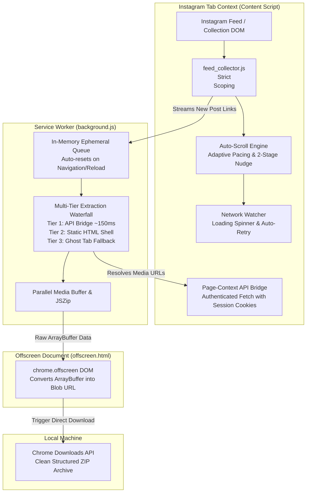

# IG Bulk Downloader Ultimate

[](LICENSE)
[](manifest.json)
[](https://buymeacoffee.com/theinfinox)

A high-performance, private, client-side Chrome Extension (Manifest V3) to bulk download Instagram posts, carousels, and saved collections directly to your local computer in full resolution.

---

## ⚖️ Legal & Fair Use Disclaimer

> **IMPORTANT:**  
> This extension is an independent, client-side open-source utility developed strictly for personal data archiving, backup, and educational research purposes.  
> It is **not affiliated with, associated with, authorized, endorsed by, or in any way officially connected to Instagram, Meta Platforms, Inc.**, or any of their subsidiaries.  
> The name "Instagram" as well as related names, marks, emblems, and images are registered trademarks of their respective owners.  
> Users are solely responsible for ensuring their usage complies with Instagram's Terms of Use, applicable local laws, and the intellectual property rights of original content creators. **Do not use this software for commercial redistribution or unauthorized scraping.**

---

## ✨ Features

* **🏎️ Adaptive Auto-Scroll Engine:**  
  Automatically scrolls collections and profile feeds with adjustable network pacing:
  * `⚡ Fast (~300ms)` - Default for broadband/fiber connections.
  * `🏎️ Blazing (~150ms)` - Ultra-low-latency instant jumping with zero animation lag.
  * `🛡️ Balanced (~700ms)` - Safe pacing for shared connections.
  * `⏳ Throttled (~1.5s)` - Ideal for slow or harsh networks.
* **🛡️ 2-Stage Smart End Verification:**  
  Detects the true end of collections with non-bouncing micro-nudges, ensuring no lazy-loaded posts are left behind.
* **🧹 Scoped Ephemeral Queues:**  
  Queues are strictly scoped to the active page view. Navigating to a new collection or refreshing the page automatically resets the queue to zero—no leftover links from past sessions or other profiles.
* **📦 100% Client-Side Offline ZIP:**  
  Bundles multiple posts into organized, structured `.zip` files completely inside the browser using `JSZip` and Chrome's Offscreen Document API. Zero data leaves your machine.
* **📁 Clean Folder Hierarchy:**  
  Single-image posts download directly, while multi-slide carousels are neatly extracted into subfolders (`Post_Title/1.jpg`, `2.jpg`).
* **🔄 Native Auto-Recovery:**  
  Detects and automatically clicks Instagram's native "Retry" / "Try again" buttons if pagination temporarily stumbles.
* **🔒 Zero Telemetry & Privacy Focused:**  
  No tracking, no analytics, no third-party APIs, and no external servers. Operates using your existing logged-in browser session.

---

## 🏗️ Architecture & How It Works

The extension is engineered around a modular, non-destructive Manifest V3 architecture designed for high throughput, zero telemetry, and maximum stability:



### 1. Link Harvester & Auto-Scroll Engine (`feed_collector.js`)
* **Strict `<main>` Scoping:** Ignores sidebars, header trays, suggested accounts, and recommendation carousels. Only harvests genuine post and reel links within the active collection grid.
* **Zero-Lag Adaptive Pacing:** When scrolling fast (`< 400ms`), the engine uses `behavior: 'instant'` to eliminate CSS smooth-scroll animation bottlenecks and immediately fire Instagram's `IntersectionObserver`.
* **Network Auto-Recovery:** Detects and automatically clicks Instagram's native "Retry" / "Try again" buttons if pagination temporarily stumbles.
* **2-Stage End Verification:** When reaching the bottom of the feed or footer, it performs two patient micro-nudges (80–140px) to verify whether more items are pending before cleanly concluding.
* **Ephemeral Scoping:** Detects SPA navigation (`PAGE_VIEW_CHANGED`) and page reloads (`chrome.tabs.onUpdated`) to instantly clear old links, ensuring the queue strictly matches the active feed.

### 2. Multi-Tier Extraction Waterfall (`background.js`)
* **Tier 1 (Page-Context API Bridge ~150ms):** Converts the 11-character post shortcode to a numerical Media ID and queries `/api/v1/media/{media_id}/info/` directly through the active Instagram tab. Uses your logged-in cookies and CSRF token naturally without sending passwords or credentials anywhere.
* **Tier 2 (Static HTML Shell ~400ms):** If the API bridge encounters an obstacle, fetches the post's public HTML shell and parses embedded `xdt_shortcode_media` JSON scripts.
* **Tier 3 (Ghost Tab Fallback):** For stubborn edge cases or complex private accounts, creates an off-screen background tab to allow React to render the full-resolution carousel slides.

### 3. Client-Side Archiver & Offscreen Pipeline (`offscreen.js`)
* Chrome Manifest V3 Service Workers run in headless workers without DOM access, which disables `URL.createObjectURL(blob)`.
* This extension uses the **Chrome Offscreen API** (`chrome.offscreen`):
  1. The service worker buffers high-resolution images into binary `ArrayBuffer` objects with `JSZip`.
  2. The raw buffer is transferred to the offscreen document.
  3. The offscreen document creates a native `blob:` URL and immediately triggers `chrome.downloads.download()`.
  4. The result: Blazing fast, 100% offline ZIP generation with zero base64 memory bloat.

---

## 📥 Installation

1. Clone or download this repository to your computer:
   ```bash
   git clone https://github.com/YOUR_USERNAME/ig-bulk-downloader.git
   ```
2. Open Google Chrome (or any Chromium browser such as Brave, Edge, or Vivaldi).
3. Navigate to:
   ```text
   chrome://extensions/
   ```
4. Enable **Developer mode** using the toggle switch in the top-right corner.
5. Click **Load unpacked** in the top-left corner.
6. Select the `ig_ultimate_extension` folder.
7. The extension icon will now appear in your browser toolbar!

---

## 🚀 How to Use

1. Navigate to any Instagram page (e.g. your **Saved Collections**, a **Profile Grid**, or an Explore feed).
2. Click the **IG Bulk Downloader** icon in your toolbar.
3. Choose your desired **Target Limit** (e.g., `100` posts, or `0` for All until the end of the collection).
4. Click **`📜 Start Auto-Scroll`**. The extension will smoothly harvest the post links in the current view.
5. When scrolling finishes, select your preferred speed mode (`Turbo`, `Balanced`, or `Extreme`) and click **`▶ Start`**.
6. Your media will be compiled into a neat ZIP archive in your default Downloads directory!

---

## ☕ Support the Project

If this tool saved you time or made your workflow easier, consider supporting its open-source maintenance:

[](https://buymeacoffee.com/theinfinox)

---

## 🔒 Privacy & Data Safety

This extension does not collect, transmit, or store any personal data. For detailed information, see our [Privacy Policy](PRIVACY.md).

---

## 📄 License

This project is licensed under the [MIT License](LICENSE) — see the LICENSE file for details.
